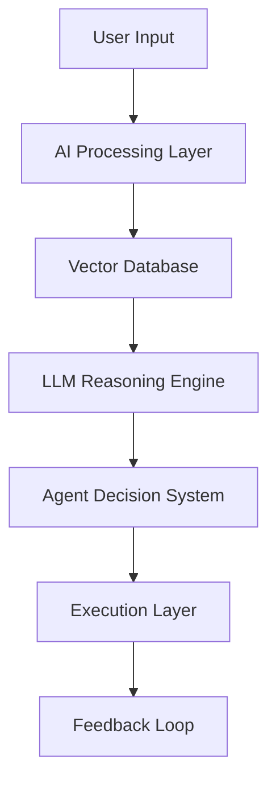

<!-- ================= HEADER ================= -->
<p align="center">
  
</p>

<p align="center">
  
</p>

---

# 🧠 AI CORE: DEV ANANDHAN

```bash
> boot --system dev.jarvis
```

```yaml
identity: AI Systems Engineer
mode: Autonomous
specialization:
  - Agentic AI Systems
  - RAG Architectures
  - Automation Engines
  - Privacy Intelligence

status: ACTIVE 🚀
```

---

# ⚡ HUMAN → AI TRANSFORMATION

<p align="center">
  
</p>

```diff
- Traditional Coding
+ Autonomous AI Systems
```

---

# ⚙️ SYSTEM MODULES

## 🔐 SHADOWLENS.exe
```bash
> run shadowlens --mode realtime
```

```diff
+ Detects PII leakage
+ Tracks hidden data flows
+ Flags policy violations
```

accuracy: 92%  
type: Privacy Intelligence Engine  

---

## 🤖 AUTODEV.ai
```bash
> execute autodev --full-cycle
```

```diff
+ Code generation
+ Automated testing
+ Deployment orchestration
```

impact:  
-60% manual work  
+35% reliability  

---

## 🧠 RAG CORE SYSTEM
```bash
> load rag --multimodal
```

```diff
+ Text / Image / Audio processing
+ Vector DB retrieval
+ Offline AI pipeline
```

latency: -30%  

---

## 🎤 HIREWISE.bot
```bash
> start interview-sim
```

```diff
+ Voice-based AI interviewer
+ Resume parsing
+ Semantic scoring
```

---

# 🛰️ ARCHITECTURE VIEW



---

# ⚙️ TECH STACK

<p align="center">
  
</p>

---

# 📊 LIVE SYSTEM STATUS

<p align="center">
  
  
</p>

---

# 🧠 PROCESSING CAPABILITIES

```bash
> analyze --skills
```

```diff
+ Python / JavaScript / Java
+ React / Node / Express
+ LangChain / FAISS / Transformers
+ AWS / GCP / Docker
```

---

# 🏆 SYSTEM ACHIEVEMENTS

```bash
> fetch achievements
```

```diff
+ Hackathon Winner (Internship Awarded)
+ 500+ Problems Solved (HackerRank Gold)
+ 150+ LeetCode Problems
+ 23 Google Skill Boost Badges
+ Top 32 Finalist – Impactathon
```

---

# 🌐 CONNECT

```bash
> open channels
```

<p align="center">
  <a href="https://github.com/YOUR_USERNAME">
    
  </a>
  <a href="https://linkedin.com/in/YOUR_LINKEDIN">
    
  </a>
</p>

---

# ⚡ SYSTEM MESSAGE

```bash
> message
```

```diff
- I write code
+ I build autonomous AI systems that replace workflows
```

---

<p align="center">
  
</p>
