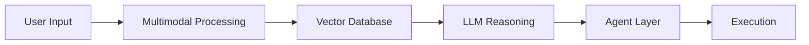

<!-- ================= HERO ================= -->

  

  

---

# 👨‍💻 PROFILE OVERVIEW

  <b>AI Full Stack Engineer</b> specializing in building <b>autonomous AI systems</b>, <b>multimodal RAG pipelines</b>, and <b>privacy-first intelligence platforms</b>.

  🚀 <b>60% Dev Effort Reduced</b> &nbsp;&nbsp;|&nbsp;&nbsp; 🎯 <b>92% AI Accuracy</b> &nbsp;&nbsp;|&nbsp;&nbsp; ⚙️ <b>40+ Workflows Automated</b>

---

# ⚡ HUMAN → AI TRANSFORMATION

  

<b>From writing code → building intelligent autonomous systems</b>

---

# 🚀 FEATURED SYSTEMS

<table>
<tr>
<td width="50%" valign="top">

### 🔐 ShadowLens
<b>AI Privacy Intelligence Platform</b>

- Detects PII leakage & hidden tracking  
- Real-time data-flow monitoring  
- Policy violation detection  

🎯 <b>92% Accuracy</b>  

</td>

<td width="50%" valign="top">

### 🤖 AutoDev
<b>Autonomous AI Developer</b>

- AI-powered coding, testing & deployment  
- Multi-agent orchestration  
- RAG + vector DB integration  

⚡ <b>-60% manual effort</b>  

</td>
</tr>

<tr>
<td width="50%" valign="top">

### 🧠 Multimodal RAG
<b>Offline Intelligent Retrieval</b>

- Text, image, audio processing  
- FAISS-based vector search  
- Optimized pipeline  

⚡ <b>-30% latency</b>  

</td>

<td width="50%" valign="top">

### 🎤 HireWise AI
<b>AI Interview Assistant</b>

- Voice-based mock interviews  
- Resume parsing  
- Real-time scoring  

</td>
</tr>
</table>

---

# 🧩 SYSTEM ARCHITECTURE

---

# ⚙️ TECH STACK

  

---

# 📊 GITHUB ANALYTICS

  
  

---

# 🏆 ACHIEVEMENTS

- 🥇 Hackathon Winner (Internship Awarded)  
- 🧠 500+ Problems Solved (Gold)  
- ☁️ 23 Google Skill Boost Badges  
- 🚀 ISRO Hackathon Shortlisted  

---

# 🌐 CONNECT

  
  

---

# ⚡ FINAL MESSAGE

<b>I build intelligent systems — not just code.</b>

  

